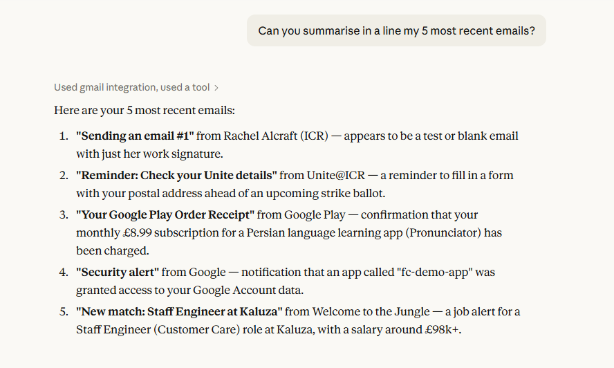
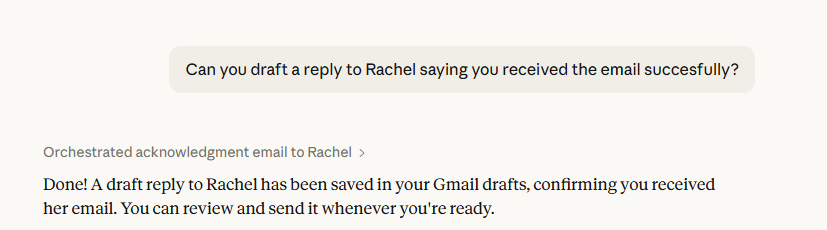
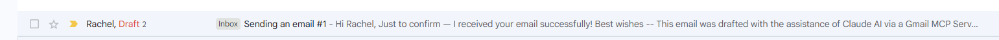
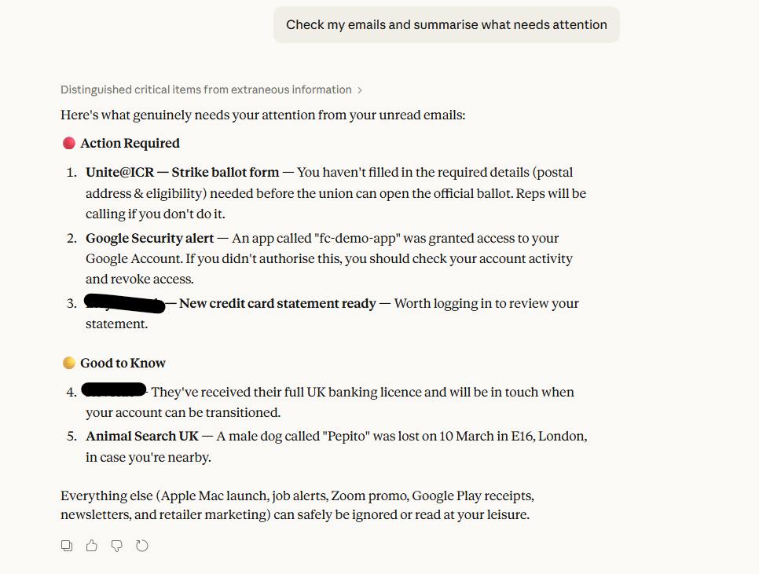
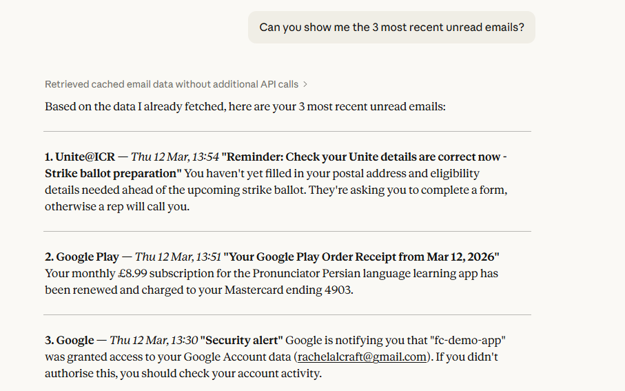
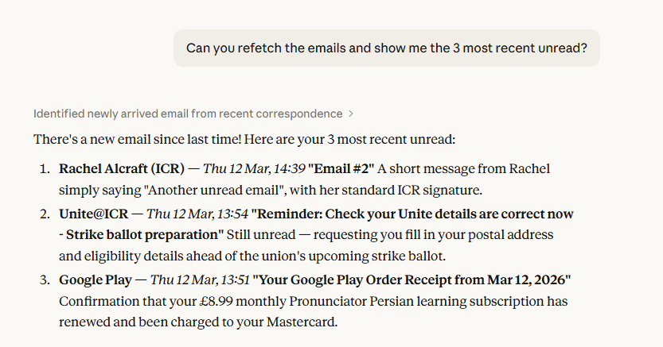

# Gmail MCP Server

## Overview
This is a demo project of a Model Context Protocol (MCP) server connecting Claude Desktop and Gmail, allowing Claude to read emails and create draft replies through natural language conversation. MCP is a standard that allows AI assistants to call external tools and services.

This project is part of an application proocess for an apprenticeship as an ML Engineer.

## Pre-requisites
The project uses:
- conda/miniforge   
- A google cloud project with Gmail API enabled and OAuth credientials - see SETUP.md  
- Claude Desktop installed  
- A `credentials.json` file in the project root from Google API

## Project Structure
```
fc-demo/
├── server.py              # Entry point — starts the MCP server
├── gmail_mcp/
│   ├── __init__.py        # Package marker
│   ├── helpers.py         # Utility functions (decode, headers, signature)
│   ├── gmail_client.py    # All Gmail API interaction and authentication
│   └── tools.py           # MCP tool definitions and handlers
├── tests/
│   ├── test_auth.py       # One-time OAuth setup script
│   ├── smoke_test.py      # Sanity check against real credentials
│   └── TESTS.md           # Testing approach and rationale
├── credentials.json       # Google OAuth credentials (not in repo — see Setup)
├── token.json             # Generated auth token (not in repo — see Setup)
├── environment.yml        # Conda environment
└── README.md
```

## Setup

<details>
<summary>Setup — click to expand</summary>

### 1. Create the conda environment
```bash
conda env create -f environment.yml
conda activate gmail-mcp
```

### 2. Set up Google Cloud & Gmail API

1. Go to [https://console.cloud.google.com](https://console.cloud.google.com)
2. Create a new project
3. Enable the Gmail API (APIs & Services → Library → Gmail API)
4. Configure the OAuth consent screen (External, add yourself as a test user)
5. Add scopes: `gmail.readonly` and `gmail.compose`
6. Create OAuth credentials (Desktop app type)
7. Download the credentials and save as `credentials.json` in the project root

> **Keep this file private.** Never commit `credentials.json` to GitHub — it is in `.gitignore`.

### 3. Generate your token
```bash
python -m tests.test_auth
```

On WSL copy the printed URL into your Windows browser. After granting access,
`token.json` will be saved to the project root automatically.

### 4. Set up Claude Desktop

1. Download and install Claude Desktop from [https://claude.ai/download](https://claude.ai/download)
2. Edit `C:\Users\YOUR_USERNAME\AppData\Roaming\Claude\claude_desktop_config.json`
3. Add the `mcpServers` block shown in the [Connecting to Claude Desktop](#connecting-to-claude-desktop) section
4. Restart Claude Desktop

### 5. Verify everything works
```bash
python -m tests.smoke_test
```

All five checks should pass before proceeding.

</details>

## Running the Server
The server is launched automatically by Claude Desktop — you do not need to run 
it manually.

To verify it starts correctly before connecting Claude Desktop:
```bash
conda activate gmail-mcp
python server.py
```

It will appear to hang — this is correct. It is listening on stdin for connections 
from Claude Desktop. Press `Ctrl+C` to stop it.

## Connecting to Claude Desktop
Locate the config file which on windows is:  
`C:\Users\ralcraft\AppData\Roaming\Claude\claude_desktop_config.json`
Edit the file to include your server.py and the python exe path. You need to add the mcpServers section below, I provide my whole file for context:
```text
{
  "preferences": {
    "coworkWebSearchEnabled": true,
    "coworkScheduledTasksEnabled": false,
    "ccdScheduledTasksEnabled": true,
    "sidebarMode": "chat"
  },
  "mcpServers": {
    "gmail": {
      "command": "wsl.exe",
      "args": [
        "/home/ralcraft/miniforge3/envs/gmail-mcp/bin/python",
        "/home/ralcraft/DEV/gh-rae/FoundCode/fc-demo/server.py"
      ]
    }
  }
}
```
Restart Claude Desktop after editing. A hammer icon may appear but the best check is the prompts.

## Example Prompts
- Reading emails  
"Show me my unread emails"  
"Get me my last 10 emails"  
"What emails have I received today?"  
"Read my most recent 5 emails"  

- Drafting replies  
"Draft a reply to [sender] saying I'll get back to them tomorrow"  
"Reply to the email from [sender] and decline politely"  
"Write a reply to [subject] email saying yes I can make the meeting"  

- Composing new emails  
"Draft a new email to john@example.com asking about the project deadline"  
"Write an email to my team announcing the meeting is cancelled"  

- Combining both  
"Read my unread emails and draft a polite reply to any that need a response"  
"Check my emails and summarise what needs my attention"  

## Screen shots







## Known Limitations
1. In order to include the ability to use both recent and unread emails Claude needs the descrptions well speciied, I included the advise to use the recent emails for a summary rather than unread.
2. The readonly aspect means an email will remain in readonly mode even when it is effectively read on Claude (though not on gmail). This is left as-is for the demo app and is easily resolved with modify scope or id trackong client side.
3. The refresh is not automatic, so if a new email comes in during a session you won't see unless you explicitly ask to refresh. This limitation is known and could be resolved with the description, and with the explicit promting. It is clear from the response that a refresh has not ocurred (see screen shots).
4. Tokens expire after 7 days and a new token need to be created with test_auth.py

## Design Decisions
1. It is readonly by design as a test project for an application. This is safer than giving it change access to me gmail inbox. This is a pronciple of least privilege and appropriate for the task.
2. The package structure is modular to seperate concerns for re-use, testing and readability.
3. A smoke test is chosen over unit tests for demonstration of full stack working against live credentials, again appropriate for the task.
4. A note that the description in `tools` is not just description, but the effective function definition that Claude uses to understand the API, and these are written with that level of specification in mind.
5. This project is designed for WSL use, with the limitation on browser use in the command line (open_broowser=False), and wsl.exe used in Claude Desktop config.

## Tests

See [tests/TESTS.md](tests/README.md) for the testing approach and rationale.

### Auth setup
```bash
python -m tests.test_auth
```

Run once before first use, or any time `token.json` is deleted or expires.

### Smoke test
```bash
python -m tests.smoke_test
```

Run after any significant change to verify the whole stack works before 
restarting Claude Desktop. All five checks should pass.

## Stretch Goals (Not Implemented)

